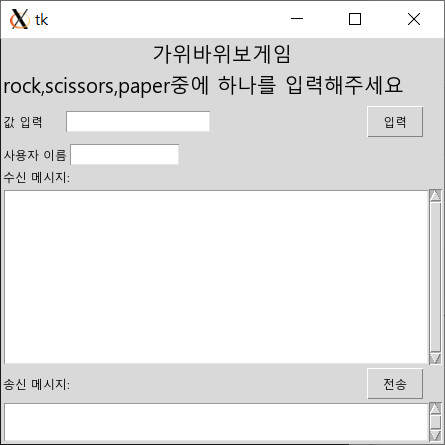
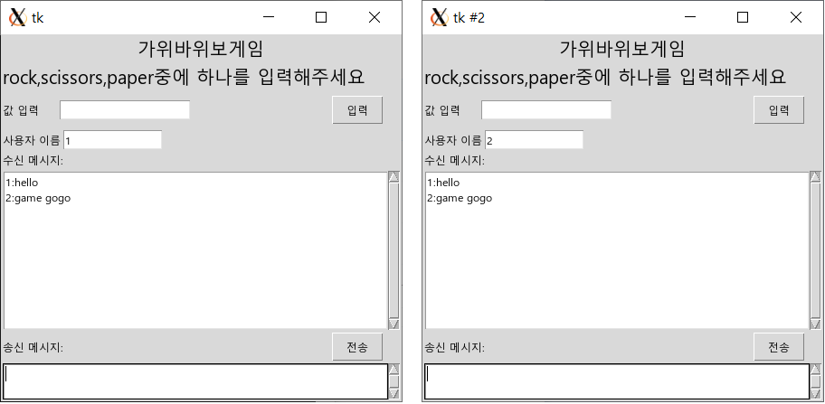
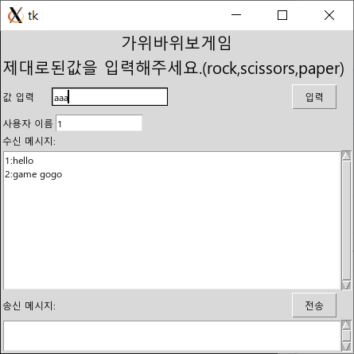
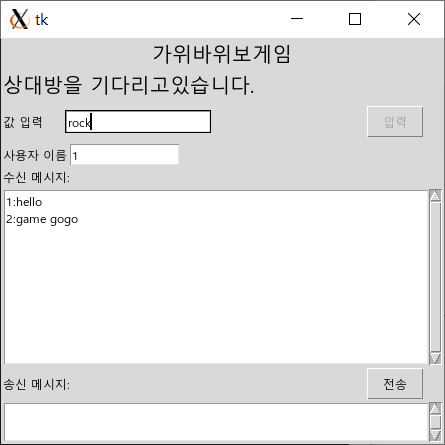
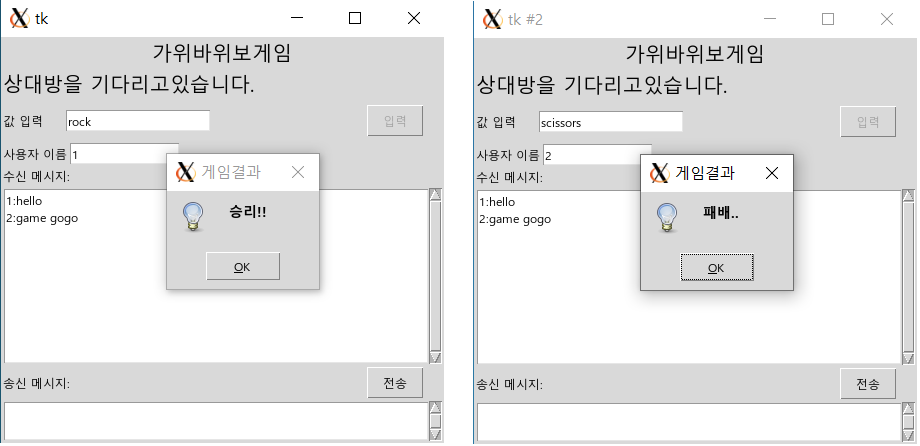
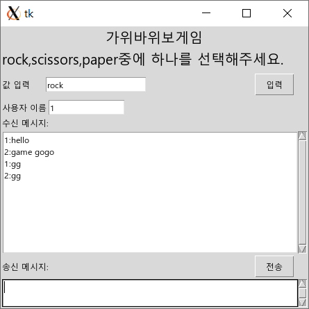
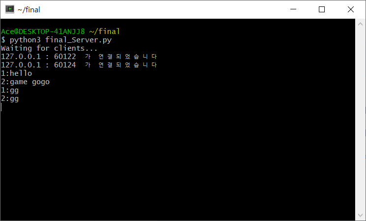

# 소켓 프로그래밍 기말고사 과제 - 201944060 이태연

## 개요
기말고사 대체 과제로 만드려고하는 것은 채팅기능을 포함한 가위바위보 게임이다.

## 목적
이 프로그램을 만들게 된 목적은 서로 채팅기능을 이용하면서 간단한 게임을 한번 구현해보고 싶어서 만들게 되었다.

## 설계및기능
참가한 모든 클라이언트는 서로 채팅을 할 수 있도록 설계했다.
참가한 클라이언트 중 가위바위보 게임을 하고 싶은 클라이언트가 2명 있으면 게임을 시작하도록 하고 입력된 값을 바탕으로 게임의 승패가 알려준다.
만든 프로그램은 크게 2가지 기능을 가지고 있다.
1. 채팅기능
2. 가위바위보 게임 기능

## 차이점
15주차에 진행했던 멀티 채팅 서버 프로그램을 응용하여 개발하였다.
차이점이라고 하면 기존 멀티 채팅 서버 프로그램은 단순 채팅기능만 가지고 있지만 이번 만든 프로그램은 채팅기능과 2명에서 함께 진행 할 수 있는 간단한 가위바위보 게임 기능을 추가하였다.

## 실행화면
프로그램을 실행시켰을 때 가장 먼저 등장하는 화면 
</img> 
클라이언트가 채팅기능을 이용하는 화면 
</img> 
가위바위보 게임에서 엉뚱한 값을 입력했을 때 화면 
</img> 
가위바위보 게임에서 정상적인 값을 입력했을 때 화면 
</img> 
가위바위보 게임 결과 화면 
</img> 
가위바위보 게임이 끝난 화면 
</img> 
종료된후 서버 화면 
</img>
